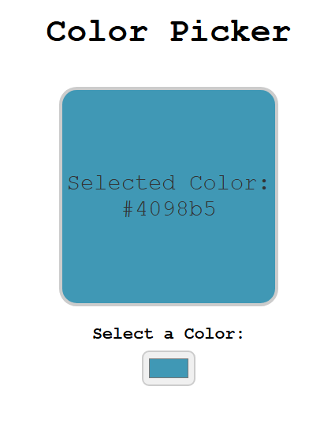

# Color Picker



Simple Color Picker.

## Description

This is a simple Color picker made using React.js.

## Getting Started

### Dependencies

### Dependencies

- **Node.js** (Recommended: Latest LTS version)
- **npm** or **yarn** (Comes with Node.js)
- **React** (Automatically installed via `create-react-app`, Vite, or Next.js)
- **React DOM** (For rendering React components)
- **Browser**: Google Chrome, Firefox, Edge, or any modern web browser
- **Operating System**: Windows, macOS, or Linux

### Installing

1. Clone or download the repository to your local machine:

```sh
git clone https://github.com/Ashutosh-88/-Color-Picker-App
```

2. Navigate to the project folder in your terminal:

```sh
cd -Color-Picker-App
```

3. Open the `index.html` file in your web browser.

### Executing Program

1. To open the app, simply open the `index.html` file in your browser.
2. Click the button to change color. (located below Select a Color)
3. Selected Color is then displayed with its hex value.

## Help

If you encounter any issues, try the following troubleshooting steps:

### 1. Check your browser

- Ensure you are using a modern browser like **Chrome, Firefox, or Edge**.
- Make sure **JavaScript is enabled** in your browser settings.

### 2. Check the browser console

- Open the **developer console**:
  - **Windows/Linux:** Press `F12` or `Ctrl + Shift + I`
  - **Mac:** Press `Cmd + Option + I`
- Look for error messages in the **Console** tab.

### 3. Restart the development server

If you are running a React app locally, try restarting the development server:

```sh
npm start
```

If using Vite, use:

```sh
npm run dev
```

### 4. Check dependencies

Make sure Node.js and npm are installed by running:

```sh
node -v
npm -v
```

If the issue persists, try reinstalling dependencies:

```sh
rm -rf node_modules package-lock.json
npm install
```

### 5. Still need help?

- Check the official [React documentation](https://react.dev/).
- Search for solutions on [Stack Overflow](https://stackoverflow.com/questions).
- Open an issue in this repository or ask for help in the Discussions section.

## Authors

- [Ashutosh Tiwari](https://www.linkedin.com/in/ashutosh-tiwari-70b504190/)

## Version History

- 0.1
  - Initial Release

## License

This project is licensed under the [MIT License](https://opensource.org/licenses/MIT) - see the LICENSE.md file for details.

```

```
